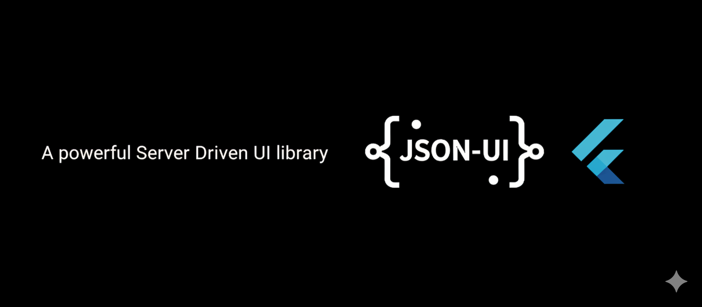

# JSON UI Builder



A server-driven UI library for Flutter that creates dynamic UIs from JSON configurations. JSON UI Builder supports fetching configurations from local assets, HTTP endpoints, and local files.

#ui #widget #server-driven-ui #dynamic-widgets

## Features

- 🚀 **Server-driven UI**: Create Flutter UIs from JSON configurations
- 📱 **Cross-Platform**: Works on Android, iOS, Web, Windows, macOS, and Linux
- 🌐 **Multiple Data Sources**: Support for local assets, HTTP endpoints, and local files
- 🎨 **Rich Widget Support**: Built-in support for common Flutter widgets
- 🔧 **Extensible**: Easy to extend with custom widgets
- 🧪 **Well Tested**: Comprehensive test coverage
- 📚 **Type Safe**: Full type safety with JSON serialization
## Supported Widgets

- **Layout**: Scaffold, Column, Row, Container, Padding, Center, Expanded, Flexible, SizedBox
- **Text**: Text with full TextStyle support
- **Buttons**: ElevatedButton, TextButton, IconButton
- **Navigation**: AppBar
- **Lists**: ListView, GridView, PageView
- **Cards**: Card
- **Input**: GestureDetector
- **Display**: Icon, Divider
- **Utility**: Spacer
- **And more...**

📚 **[Complete Documentation](documentation.md)** - Comprehensive widget reference with examples

📖 **Documentation URL**: `https://github.com/vikneshgopinathan/flexi_ui/blob/main/documentation.md`

🔗 **GitHub Repository**: `https://github.com/vikneshgopinathan/flexi_ui`

## Installation

Add this to your package's `pubspec.yaml` file:

```yaml
dependencies:
  json_ui_builder: ^0.1.2
```

## Platform Support

FlexiUI works on all Flutter-supported platforms:

- 📱 **Mobile**: Android, iOS
- 🌐 **Web**: Chrome, Firefox, Safari, Edge  
- 🖥️ **Desktop**: Windows, macOS, Linux

## Quick Start

### Running the Example

The example app demonstrates FlexiUI across all platforms:

```bash
# Clone the repository
git clone https://github.com/vikneshgopinathan/flexi_ui.git
cd flexi_ui/example

# Run on different platforms
flutter run -d chrome          # Web (Chrome)
flutter run -d macos           # macOS Desktop
flutter run -d windows         # Windows Desktop
flutter run -d linux           # Linux Desktop
flutter run -d android         # Android Mobile
flutter run -d ios             # iOS Mobile
```

### Example App Features

The example app includes:

- 🛍️ **E-commerce Demo**: Complete e-commerce app with homepage, promotions, and product details
- 📱 **Simple Example**: Basic FlexiUI usage with asset data source
- 📚 **Documentation Links**: Direct access to comprehensive documentation
- 🌐 **Cross-Platform**: Works seamlessly on all supported platforms

### 1. Basic Usage

```dart
import 'package:json_ui_builder/json_ui_builder.dart';

// Load from asset
const dataSource = DataSourceConfig(
  type: DataSourceType.asset,
  assetPath: 'assets/config.json',
);

FlexiUI(dataSource: dataSource)
```

### 2. HTTP Configuration

```dart
const dataSource = DataSourceConfig(
  type: DataSourceType.http,
  url: 'https://api.example.com/ui-config',
  headers: {'Authorization': 'Bearer token'},
  timeout: Duration(seconds: 30),
);

FlexiUI(dataSource: dataSource)
```

### 3. Direct Configuration

```dart
final config = FlexiUIConfig(
  rootWidget: WidgetConfig(
    type: 'Scaffold',
    child: WidgetConfig(
      type: 'Center',
      child: WidgetConfig(
        type: 'Text',
        params: {'text': 'Hello World!'},
      ),
    ),
  ),
);

FlexiUIBuilder(config: config)
```

## JSON Configuration Format

### Basic Structure

```json
{
  "type": "Scaffold",
  "params": {
    "backgroundColor": "blue"
  },
  "child": {
    "type": "Column",
    "params": {
      "mainAxisAlignment": "center"
    },
    "children": [
      {
        "type": "Text",
        "params": {
          "text": "Hello World",
          "style": {
            "fontSize": 24,
            "color": "white",
            "fontWeight": "w700"
          }
        }
      }
    ]
  }
}
```

### Supported Parameters

#### Text Widget
```json
{
  "type": "Text",
  "params": {
    "text": "Your text here",
    "style": {
      "fontSize": 16,
      "fontWeight": "w400",
      "color": "black",
      "fontStyle": "normal"
    }
  }
}
```

#### Container Widget
```json
{
  "type": "Container",
  "params": {
    "width": 100,
    "height": 50,
    "color": "red",
    "padding": {
      "left": 10,
      "right": 10,
      "top": 5,
      "bottom": 5
    }
  }
}
```

#### Column/Row Widgets
```json
{
  "type": "Column",
  "params": {
    "mainAxisAlignment": "center",
    "crossAxisAlignment": "start"
  },
  "children": [
    {
      "type": "Text",
      "params": {"text": "First child"}
    },
    {
      "type": "Text", 
      "params": {"text": "Second child"}
    }
  ]
}
```

## Advanced Usage

### Custom Loading and Error Widgets

```dart
FlexiUI(
  dataSource: dataSource,
  loadingWidget: CircularProgressIndicator(),
  errorWidget: Text('Custom error message'),
  onError: () => print('Configuration failed to load'),
  onSuccess: () => print('Configuration loaded successfully'),
)
```

### Extending with Custom Widgets

You can extend the widget factory to support custom widgets:

```dart
// In your custom widget factory
Widget createCustomWidget(WidgetConfig config) {
  switch (config.type) {
    case 'MyCustomWidget':
      return MyCustomWidget(
        // Parse your custom parameters
      );
    default:
      return WidgetFactory.createWidget(config);
  }
}
```

## Examples

Check out the `example/` directory for complete working examples:

- **Asset Example**: Loading configuration from local assets
- **HTTP Example**: Fetching configuration from remote endpoints
- **Builder Example**: Using FlexiUIBuilder with direct configuration

## Testing

Run the tests with:

```bash
flutter test
```

## Contributing

1. Fork the repository
2. Create your feature branch (`git checkout -b feature/amazing-feature`)
3. Commit your changes (`git commit -m 'Add some amazing feature'`)
4. Push to the branch (`git push origin feature/amazing-feature`)
5. Open a Pull Request

## License

This project is licensed under the MIT License - see the [LICENSE](LICENSE) file for details.

## Roadmap

- [ ] More widget support (Image, Icon, etc.)
- [ ] Animation support
- [ ] Theme integration
- [ ] State management integration
- [ ] Custom widget registration API
- [ ] Performance optimizations